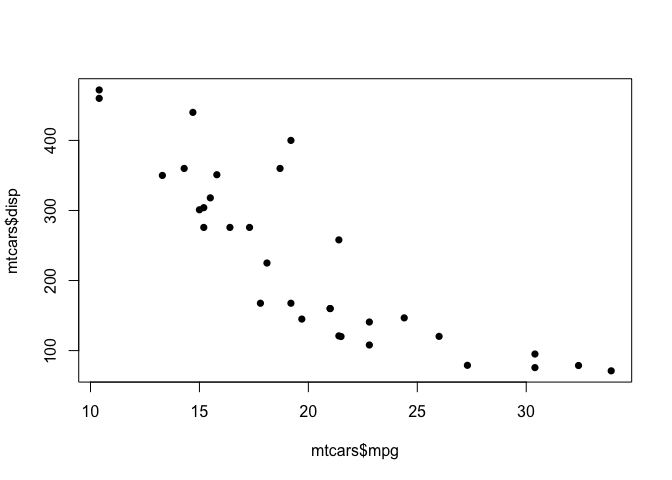
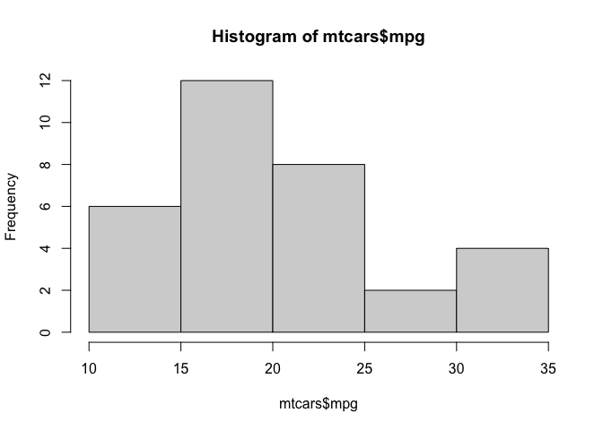
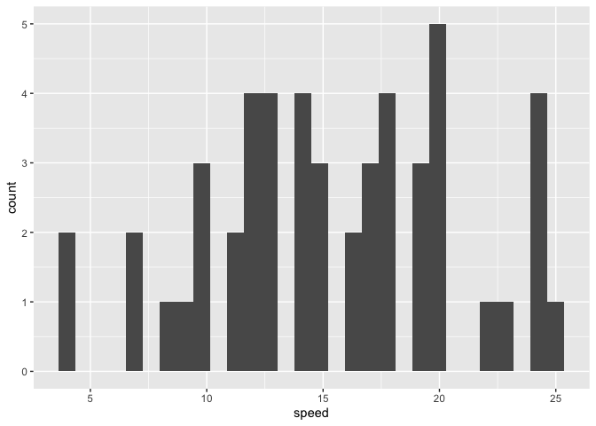
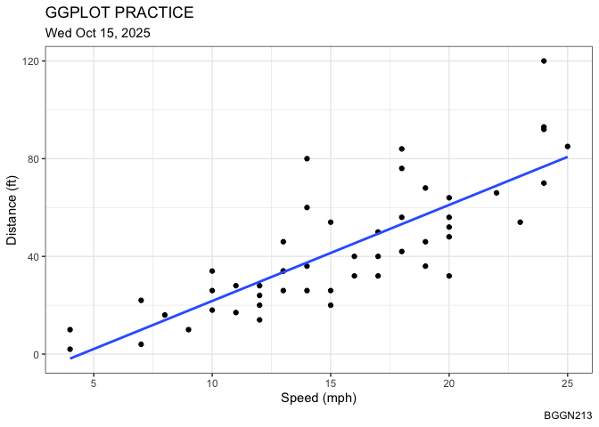
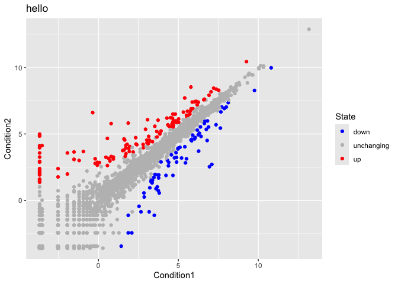
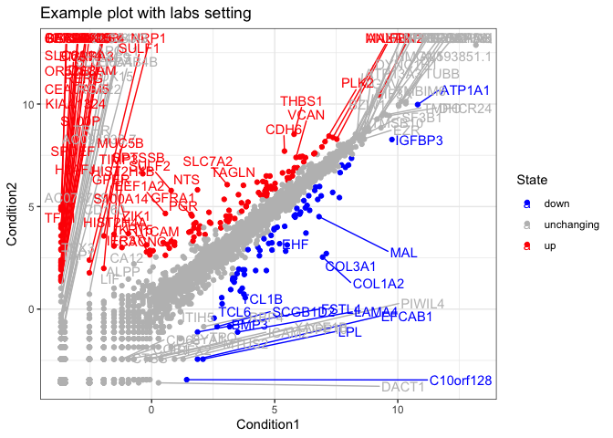
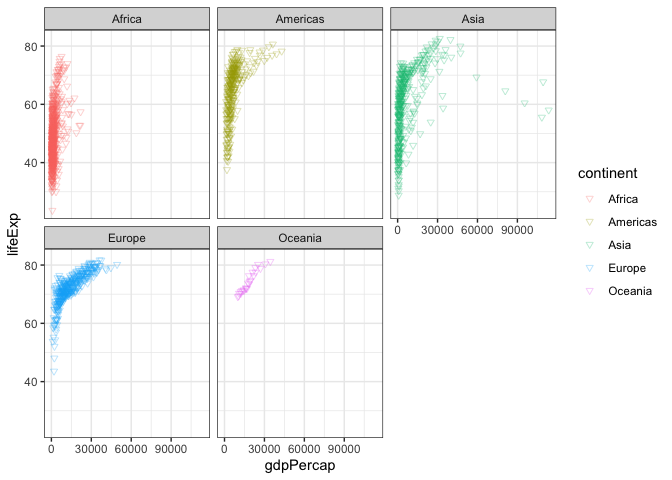

# Class05: Data Visualization with ggplot
Wade Ingersoll (PID: A69038080)

Today we are playing with plotting and graphics in R.

There are lots of ways to make cool figures in R. There is “base” R
graphics (`plot()`, `hist()`, `boxplot()`, etc.)

There is also add-on packages, like **ggplot**.

``` r
# View the top 6 rows of 'cars' dataset
head(cars)
```

      speed dist
    1     4    2
    2     4   10
    3     7    4
    4     7   22
    5     8   16
    6     9   10

Let’s plot this with “base” R:

``` r
# Plot 'cars' with base R
plot(cars)
```


``` r
# View top 6 rows of 'mtcars' dataset
head(mtcars)
```

                       mpg cyl disp  hp drat    wt  qsec vs am gear carb
    Mazda RX4         21.0   6  160 110 3.90 2.620 16.46  0  1    4    4
    Mazda RX4 Wag     21.0   6  160 110 3.90 2.875 17.02  0  1    4    4
    Datsun 710        22.8   4  108  93 3.85 2.320 18.61  1  1    4    1
    Hornet 4 Drive    21.4   6  258 110 3.08 3.215 19.44  1  0    3    1
    Hornet Sportabout 18.7   8  360 175 3.15 3.440 17.02  0  0    3    2
    Valiant           18.1   6  225 105 2.76 3.460 20.22  1  0    3    1

Let’s plot `mpg` vs `disp`

``` r
plot(mtcars$mpg, mtcars$disp, pch=16)
```



``` r
hist(mtcars$mpg)
```



## GGPLOT

The main function in the ggplot2 package is `ggplot()`. First, I need to
install the **ggplot2** package. I can install any package with the
function `install.packages()`

> **N.B.** I never want to run `install.packages()` in my quarto source
> document!!

``` r
# In the console, run install.packages("ggplot2"). This only needs to be done once!
# Load ggplot2
library(ggplot2)

# Plot cars dataset with ggplot and add geom_point() to generate scatterplot
ggplot(cars) +
  aes(x=speed, y=dist) +
  geom_point()
```


``` r
ggplot(cars) +
  aes(speed) +
  geom_histogram()
```

    `stat_bin()` using `bins = 30`. Pick better value `binwidth`.



Every ggplot needs at least 3 things:

- The **data** (given with `ggplot(cars)`)
- The **aesthetic** mapping (given with `aes()`)
- The **geom** (given by `geom_point()`)

> For simple canned graphs “base” R is nearly always faster (in both
> writing the code and executing it)

### Adding more layers

Let’s add a line and a title, subtitle and caption as well as custom
axis labels

``` r
ggplot(cars) +
  aes(x=speed, y=dist) +
  geom_point() +
  geom_line()
```


``` r
ggplot(cars) +
  aes(x=speed, y=dist) +
  geom_point() +
  geom_smooth(method="lm", se=FALSE) +
  labs(title = "GGPLOT PRACTICE", 
       subtitle = "Wed Oct 15, 2025", 
       x = "Speed (mph)", 
       y = "Distance (ft)",
       caption = "BGGN213") +
  theme_bw()
```

    `geom_smooth()` using formula = 'y ~ x'



## Plot some expression data

Read data file from online URL

``` r
url <- "https://bioboot.github.io/bimm143_S20/class-material/up_down_expression.txt"
genes <- read.delim(url)
head(genes)
```

            Gene Condition1 Condition2      State
    1      A4GNT -3.6808610 -3.4401355 unchanging
    2       AAAS  4.5479580  4.3864126 unchanging
    3      AASDH  3.7190695  3.4787276 unchanging
    4       AATF  5.0784720  5.0151916 unchanging
    5       AATK  0.4711421  0.5598642 unchanging
    6 AB015752.4 -3.6808610 -3.5921390 unchanging

> Q1. How many genes are in this dataset?

There are 5196 in this dataset

> Q2. How many “up” regulated genes are there?

``` r
sum(genes$State == "up")
```

    [1] 127

There are 127 UP genes

``` r
table(genes$State)
```


          down unchanging         up 
            72       4997        127 

``` r
ggplot(genes) +
  aes(x=Condition1, y=Condition2, col=State) +
  geom_point()
```


``` r
p <- ggplot(genes) +
  aes(x=Condition1, y=Condition2, col=State) +
  geom_point() +
  scale_color_manual(values=c("blue", "grey", "red"))
```

``` r
p + labs(title="hello")
```



Example of adding labels

``` r
library(ggrepel)

ggplot(genes) +
  aes(x=Condition1, 
      y=Condition2, 
      col=State,
      label=Gene) +
  geom_point() +
  scale_color_manual(values=c("blue", "grey", "red")) +
  geom_text_repel(max.overlaps = 200) +
  theme_bw() +
  labs(title="Example plot with labs setting")
```

    Warning: ggrepel: 5074 unlabeled data points (too many overlaps). Consider
    increasing max.overlaps



## Going further

Playing with some different layers and the gapminder dataset…

``` r
url <- "https://raw.githubusercontent.com/jennybc/gapminder/master/inst/extdata/gapminder.tsv"

gapminder <- read.delim(url)
```

``` r
head(gapminder)
```

          country continent year lifeExp      pop gdpPercap
    1 Afghanistan      Asia 1952  28.801  8425333  779.4453
    2 Afghanistan      Asia 1957  30.332  9240934  820.8530
    3 Afghanistan      Asia 1962  31.997 10267083  853.1007
    4 Afghanistan      Asia 1967  34.020 11537966  836.1971
    5 Afghanistan      Asia 1972  36.088 13079460  739.9811
    6 Afghanistan      Asia 1977  38.438 14880372  786.1134

``` r
tail(gapminder)
```

          country continent year lifeExp      pop gdpPercap
    1699 Zimbabwe    Africa 1982  60.363  7636524  788.8550
    1700 Zimbabwe    Africa 1987  62.351  9216418  706.1573
    1701 Zimbabwe    Africa 1992  60.377 10704340  693.4208
    1702 Zimbabwe    Africa 1997  46.809 11404948  792.4500
    1703 Zimbabwe    Africa 2002  39.989 11926563  672.0386
    1704 Zimbabwe    Africa 2007  43.487 12311143  469.7093

Plot gdpPercap (x) vs lifeExp (y)

``` r
ggplot(gapminder) +
  aes(x=gdpPercap, y=lifeExp, col=continent) +
  geom_point(alpha=0.3, shape=25) +
  facet_wrap(~continent) +
  theme_bw() +
  scale_size_area(max_size = 1)
```


