# Class 7: Machine Learning 1
Wade Ingersoll (PID: 69038080)

Today we will begin our exploration of some “classical” machine learning
approaches. We will start with clustering.

Let’s first make up some data to cluster where we know what the answer
should be.

``` r
rnorm(10)
```

     [1]  0.127567172 -0.006564841 -0.355794403 -0.071273698  1.351335128
     [6] -0.068907807 -0.079263456 -1.505819044 -0.707928350  0.668896639

``` r
hist( rnorm(1000) )
```

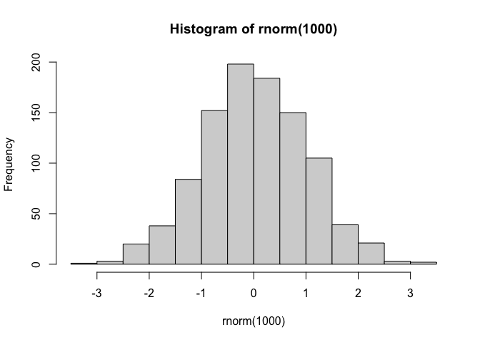

``` r
x <- c( rnorm(30, mean=-3), rnorm(30, mean=3) )
y <- rev(x)

x <- cbind(x, y)
head(x)
```

                  x        y
    [1,] -2.3348028 2.474240
    [2,] -0.4790677 3.039029
    [3,] -4.2467293 1.737097
    [4,] -3.6101086 2.069149
    [5,] -3.1694444 3.905560
    [6,] -1.0198374 4.444657

A look at x with `plot()`

``` r
plot(x)
```

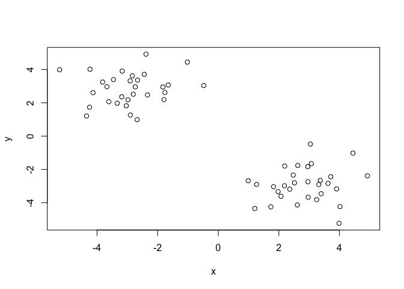

Then main function in “base” R for K-means clustering is called
`kmeans()`

``` r
k <- kmeans(x, centers = 2)
k
```

    K-means clustering with 2 clusters of sizes 30, 30

    Cluster means:
              x         y
    1  2.832225 -2.922228
    2 -2.922228  2.832225

    Clustering vector:
     [1] 2 2 2 2 2 2 2 2 2 2 2 2 2 2 2 2 2 2 2 2 2 2 2 2 2 2 2 2 2 2 1 1 1 1 1 1 1 1
    [39] 1 1 1 1 1 1 1 1 1 1 1 1 1 1 1 1 1 1 1 1 1 1

    Within cluster sum of squares by cluster:
    [1] 57.64697 57.64697
     (between_SS / total_SS =  89.6 %)

    Available components:

    [1] "cluster"      "centers"      "totss"        "withinss"     "tot.withinss"
    [6] "betweenss"    "size"         "iter"         "ifault"      

> Q. How big are the clusters (i.e. their size)?

``` r
k$size
```

    [1] 30 30

> Q. What clusters do my data points reside in?

``` r
k$cluster
```

     [1] 2 2 2 2 2 2 2 2 2 2 2 2 2 2 2 2 2 2 2 2 2 2 2 2 2 2 2 2 2 2 1 1 1 1 1 1 1 1
    [39] 1 1 1 1 1 1 1 1 1 1 1 1 1 1 1 1 1 1 1 1 1 1

> Q. Make a plot of our data colored by cluster assignment - i.e. Make a
> result figure…

``` r
plot(x, col=k$cluster)
points(k$centers, col="blue", pch=15)
```

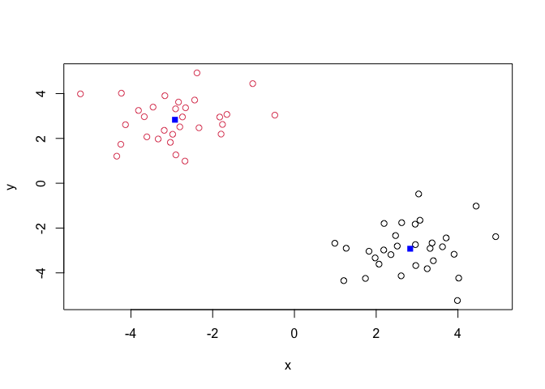

> Q. Cluster with k-means into 4 clusters and plot the results as above.

``` r
x <- c( rnorm(30, mean=-3), rnorm(30, mean=3) )
y <- rev(x)
x <- cbind(x, y)

k <- kmeans(x, centers = 4)

plot(x, col=k$cluster)
points(k$centers, col="blue", pch=15)
```

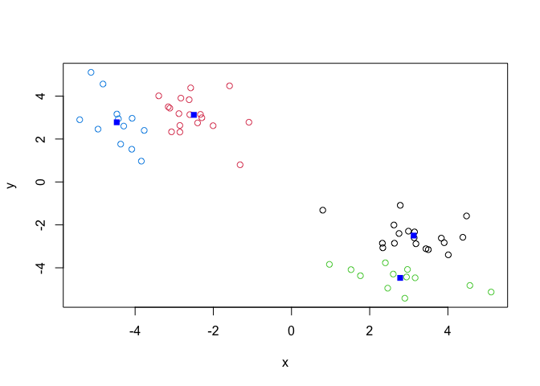

> Q. Run kmeans with center (i.e. values of k) equal 1 to 6

``` r
k1 <- kmeans(x, centers=1)$tot.withinss
k2 <- kmeans(x, centers=2)$tot.withinss
k3 <- kmeans(x, centers=3)$tot.withinss
k4 <- kmeans(x, centers=4)$tot.withinss
k5 <- kmeans(x, centers=5)$tot.withinss
k6 <- kmeans(x, centers=6)$tot.withinss

answer <- c(k1, k2, k3, k4, k5, k6)
```

Or use a for loop

``` r
answer <- NULL
for (i in 1:6) {
  answer <- c(answer, kmeans(x, centers=i)$tot.withinss)
}
answer
```

    [1] 1314.42862  133.55253  104.69459   96.85962   68.00168   57.28640

Make a “scree-plot”

``` r
plot(answer, typ="b")
```

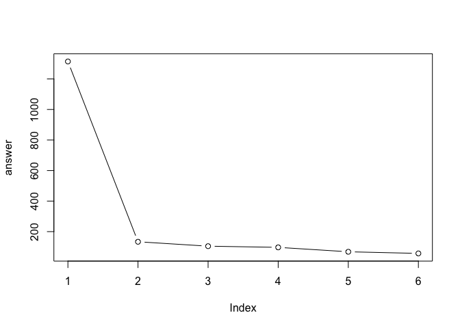

## Hierarchical Clustering

The main function in “base” R for this is called `hclust()`

``` r
d <- dist(x)
hc <- hclust(d)
hc
```


    Call:
    hclust(d = d)

    Cluster method   : complete 
    Distance         : euclidean 
    Number of objects: 60 

``` r
plot(hc)
abline(h=7, col="red")
```

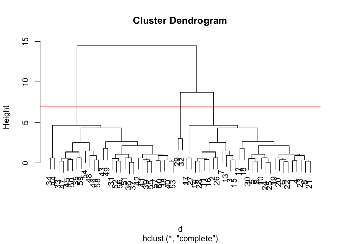

To obtain clusters from our `hclust()` result object **hc** we “cut” the
tree to yield different sub branches. For this we use the `cutree()`
function

``` r
cutree(hc, k=7)
```

     [1] 1 2 2 1 1 1 2 1 1 1 2 1 2 2 2 2 3 1 1 1 1 1 1 1 1 2 3 2 4 1 5 4 6 7 6 5 5 5
    [39] 5 5 5 5 5 7 6 6 6 6 5 6 5 5 5 6 5 5 5 6 6 5

``` r
library(pheatmap)

pheatmap(x)
```

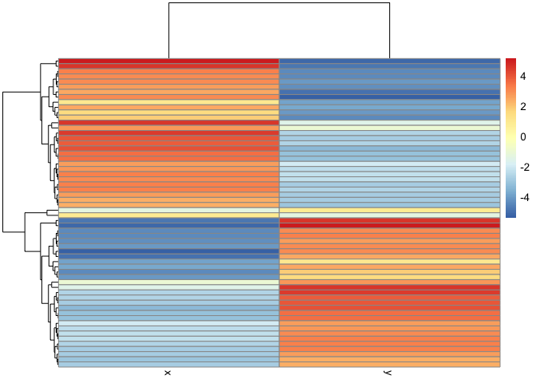

## Principal Component Analysis (PCA)

``` r
url <- "https://tinyurl.com/UK-foods"
x <- read.csv(url)
```

> Q1: How many rows and columns are in your new data frame named x? What
> R functions could you use to answer this questions?

> A: Using the code below, I found there are 17 rows and 5 columns

``` r
# Complete the following code to find out how many rows and columns are in x?
dim(x)
```

    [1] 17  5

## Preview the first 6 rows

``` r
head(x)
```

                   X England Wales Scotland N.Ireland
    1         Cheese     105   103      103        66
    2  Carcass_meat      245   227      242       267
    3    Other_meat      685   803      750       586
    4           Fish     147   160      122        93
    5 Fats_and_oils      193   235      184       209
    6         Sugars     156   175      147       139

``` r
# Note how the minus indexing works
rownames(x) <- x[,1]
x <- x[,-1]
head(x)
```

                   England Wales Scotland N.Ireland
    Cheese             105   103      103        66
    Carcass_meat       245   227      242       267
    Other_meat         685   803      750       586
    Fish               147   160      122        93
    Fats_and_oils      193   235      184       209
    Sugars             156   175      147       139

> Q2: Which approach to solving the ‘row-names problem’ mentioned above
> do you prefer and why? Is one approach more robust than another under
> certain circumstances?

> A: The code below can solve this problem. This version works better if
> you plan to run the code multiple times.

``` r
x <- read.csv(url, row.names=1)
head(x)
```

                   England Wales Scotland N.Ireland
    Cheese             105   103      103        66
    Carcass_meat       245   227      242       267
    Other_meat         685   803      750       586
    Fish               147   160      122        93
    Fats_and_oils      193   235      184       209
    Sugars             156   175      147       139

## Spotting major differences and trends

``` r
rainbow(5)
```

    [1] "#FF0000" "#CCFF00" "#00FF66" "#0066FF" "#CC00FF"

## Using base R

``` r
barplot(as.matrix(x), beside=T, col=rainbow(nrow(x)))
```


> Q3: Changing what optional argument in the above barplot() function
> results in the following plot?

> A: Changing `beside` to `F`

``` r
barplot(as.matrix(x), beside=F, col=rainbow(nrow(x)))
```


# Convert data to long format for ggplot with `pivot_longer()`

``` r
library(tidyr)

x_long <- x |> 
          tibble::rownames_to_column("Food") |> 
          pivot_longer(cols = -Food, 
                       names_to = "Country", 
                       values_to = "Consumption")

dim(x_long)
```

    [1] 68  3

> Q4: Changing what optional argument in the above ggplot() code results
> in a stacked barplot figure?

> A: Adding an argument `position = "stack"` within geom_col()

``` r
library(ggplot2)

ggplot(x_long) +
  aes(x = Country, y = Consumption, fill = Food) +
  geom_col(position = "stack") +
  theme_bw()
```

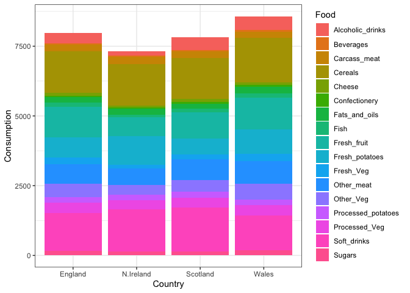

> Q5: We can use the pairs() function to generate all pairwise plots for
> our countries. Can you make sense of the following code and resulting
> figure? What does it mean if a given point lies on the diagonal for a
> given plot?

> A: Each point is a food and when they lie on the diagonal, it means
> the two countries eat it at the same rate

``` r
pairs(x, col=rainbow(nrow(x)), pch=16)
```


``` r
library(pheatmap)

pheatmap( as.matrix(x) )
```


> Q6. Based on the pairs and heatmap figures, which countries cluster
> together and what does this suggest about their food consumption
> patterns? Can you easily tell what the main differences between N.
> Ireland and the other countries of the UK in terms of this data-set?

> A: It looks like Wales and England are quite similar in their
> consumption of these foods. It is still quite difficult to tell what
> is going on in the dataset.

## PCA to the rescue

The main function in “base” R for PCA is called `prcomp()`.

As we want to do PCA on the food data for the different countries, we
will want the foods in the columns.

``` r
pca <- prcomp( t(x) )
summary(pca)
```

    Importance of components:
                                PC1      PC2      PC3     PC4
    Standard deviation     324.1502 212.7478 73.87622 2.7e-14
    Proportion of Variance   0.6744   0.2905  0.03503 0.0e+00
    Cumulative Proportion    0.6744   0.9650  1.00000 1.0e+00

``` r
pca$x
```

                     PC1         PC2        PC3           PC4
    England   -144.99315   -2.532999 105.768945  1.612425e-14
    Wales     -240.52915 -224.646925 -56.475555  4.751043e-13
    Scotland   -91.86934  286.081786 -44.415495 -6.044349e-13
    N.Ireland  477.39164  -58.901862  -4.877895  1.145386e-13

Our result object is called `pca` and it has a `$x` component that we
will look at first

> Q7. Complete the code below to generate a plot of PC1 vs PC2. The
> second line adds text labels over the data points.

``` r
library(ggplot2)

# Create a data frame for plotting
df <- as.data.frame(pca$x)
df$Country <- rownames(df)

# Plot PC1 vs PC2 with ggplot
ggplot(pca$x) +
  aes(x = PC1, y = PC2, label = rownames(pca$x)) +
  geom_point(size = 3) +
  geom_text(vjust = -0.5) +
  xlim(-270, 500) +
  xlab("PC1") +
  ylab("PC2") +
  theme_bw()
```

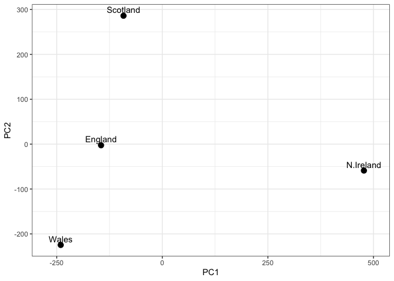

> Q8. Customize your plot so that the colors of the country names match
> the colors in our UK and Ireland map and table at start of this
> document.

``` r
library(ggplot2)

cols <- c("orange", "red", "blue", "darkgreen")

# Plot PC1 vs PC2 with ggplot
ggplot(pca$x) +
  aes(x = PC1, y = PC2, label = rownames(pca$x)) +
  geom_point(size = 3) +
  geom_text(vjust = -0.5, col=cols) +
  xlim(-270, 500) +
  xlab("PC1") +
  ylab("PC2") +
  theme_bw()
```

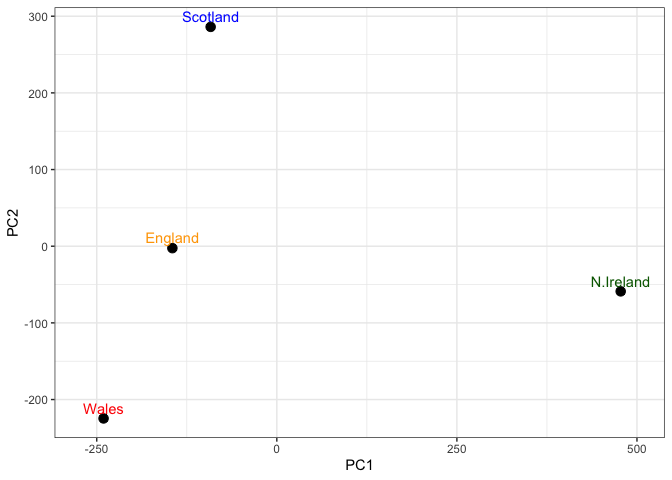

Another major result out of the PCA is the so-called “variable loadings”
or `$rotation` that tells us how the original variables (foods)
contribute to the PCs (i.e. our new axis).

``` r
ggplot(pca$rotation) +
  aes(PC1, rownames(pca$rotation)) +
  geom_col()
```


## Lets focus on PC1 as it accounts for \> 90% of variance

``` r
 ggplot(pca$rotation) +
  aes(x = PC1, 
      y = reorder(rownames(pca$rotation), PC1)) +
  geom_col(fill = "steelblue") +
  xlab("PC1 Loading Score") +
  ylab("") +
  theme_bw() +
  theme(axis.text.y = element_text(size = 9))
```

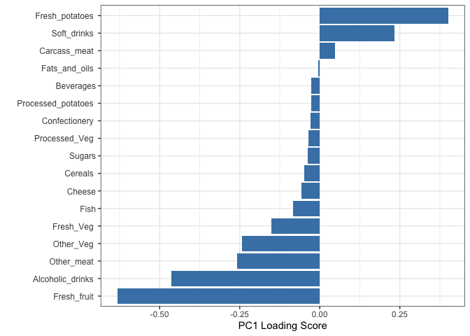

> Q9: Generate a similar ‘loadings plot’ for PC2. What two food groups
> feature prominantely and what does PC2 maninly tell us about?

``` r
 ggplot(pca$rotation) +
  aes(x = PC2, 
      y = reorder(rownames(pca$rotation), PC2)) +
  geom_col(fill = "skyblue") +
  xlab("PC2 Loading Score") +
  ylab("") +
  theme_bw() +
  theme(axis.text.y = element_text(size = 9))
```

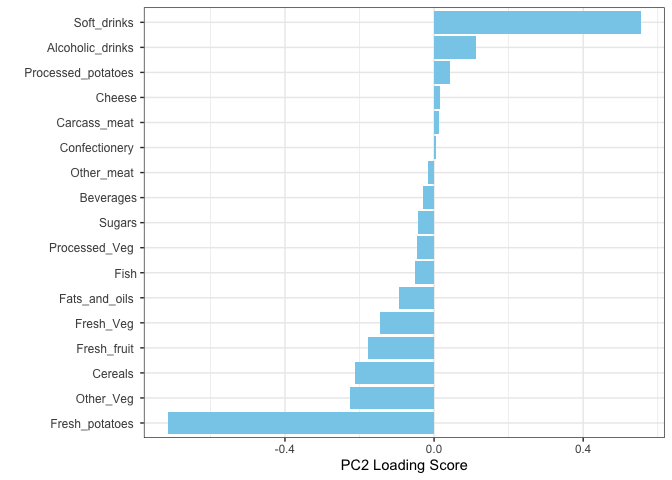

## PCA of RNA-seq data

``` r
url2 <- "https://tinyurl.com/expression-CSV"
rna.data <- read.csv(url2, row.names=1)
head(rna.data)
```

           wt1 wt2  wt3  wt4 wt5 ko1 ko2 ko3 ko4 ko5
    gene1  439 458  408  429 420  90  88  86  90  93
    gene2  219 200  204  210 187 427 423 434 433 426
    gene3 1006 989 1030 1017 973 252 237 238 226 210
    gene4  783 792  829  856 760 849 856 835 885 894
    gene5  181 249  204  244 225 277 305 272 270 279
    gene6  460 502  491  491 493 612 594 577 618 638

> Q10: How many genes and samples are in this data set? How many PCs do
> you think it will take to have a useful overview of this data set (see
> below)?

> A: Using `dim()`, there are 100 genes and 10 samples. I think it will
> take just 1 PC to have a useful overview of the data set.

``` r
dim(rna.data)
```

    [1] 100  10

``` r
## Again we have to take the transpose of our data 
pca <- prcomp(t(rna.data), scale=TRUE)

# Create data frame for plotting
df <- as.data.frame(pca$x)
df$Sample <- rownames(df)

## Plot with ggplot
ggplot(df) +
  aes(x = PC1, y = PC2, label = Sample) +
  geom_point(size = 3) +
  geom_text(vjust = -0.5, size = 3) +
  xlab("PC1") +
  ylab("PC2") +
  theme_bw()
```

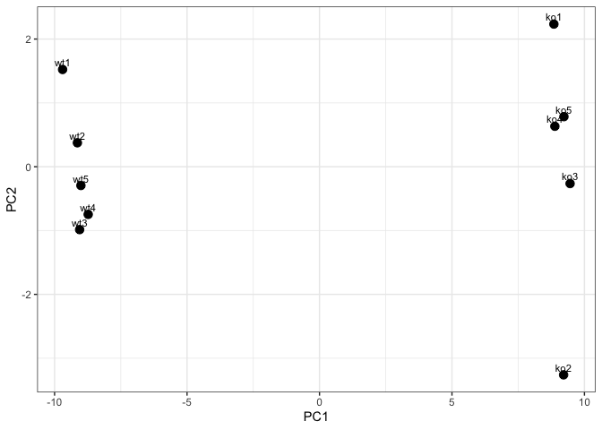

## Examine variation in original data

``` r
summary(pca)
```

    Importance of components:
                              PC1    PC2     PC3     PC4     PC5     PC6     PC7
    Standard deviation     9.6237 1.5198 1.05787 1.05203 0.88062 0.82545 0.80111
    Proportion of Variance 0.9262 0.0231 0.01119 0.01107 0.00775 0.00681 0.00642
    Cumulative Proportion  0.9262 0.9493 0.96045 0.97152 0.97928 0.98609 0.99251
                               PC8     PC9     PC10
    Standard deviation     0.62065 0.60342 3.39e-15
    Proportion of Variance 0.00385 0.00364 0.00e+00
    Cumulative Proportion  0.99636 1.00000 1.00e+00

# A quick scree plot summary of this Proportion of Variance for each PC can be obtained using ggplot:

``` r
# Calculate variance explained
pca.var <- pca$sdev^2
pca.var.per <- round(pca.var/sum(pca.var)*100, 1)

# Create scree plot data
scree_df <- data.frame(
  PC = factor(paste0("PC", 1:10), levels = paste0("PC", 1:10)),
  Variance = pca.var[1:10]
)

ggplot(scree_df) +
  aes(x = PC, y = Variance) +
  geom_col(fill = "steelblue") +
  ggtitle("Quick scree plot") +
  xlab("Principal Component") +
  ylab("Variance") +
  theme_bw()
```

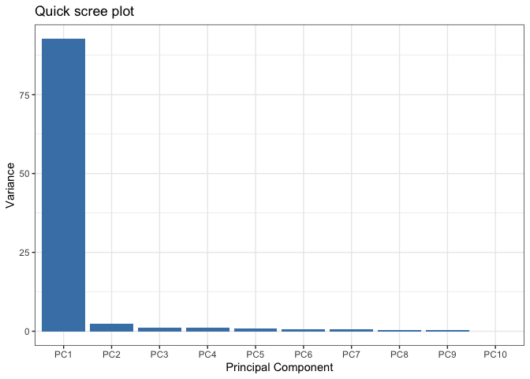

## Percent variance is often more informative to look at

``` r
pca.var.per
```

     [1] 92.6  2.3  1.1  1.1  0.8  0.7  0.6  0.4  0.4  0.0

# Create percent variance scree plot

``` r
scree_pct_df <- data.frame(
  PC = factor(paste0("PC", 1:10), levels = paste0("PC", 1:10)),
  PercentVariation = pca.var.per[1:10]
)

ggplot(scree_pct_df) +
  aes(x = PC, y = PercentVariation) +
  geom_col(fill = "steelblue") +
  ggtitle("Scree Plot") +
  xlab("Principal Component") +
  ylab("Percent Variation") +
  theme_bw()
```

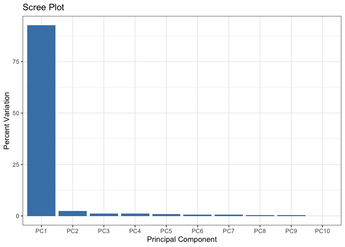

## Now lets make our main PCA plot a bit more attractive and useful…

``` r
## A vector of colors for wt and ko samples
colvec <- colnames(rna.data)
colvec[grep("wt", colvec)] <- "red"
colvec[grep("ko", colvec)] <- "blue"

# Add condition to data frame
df$condition <- substr(df$Sample, 1, 2)
df$color <- colvec

ggplot(df) +
  aes(x = PC1, y = PC2, color = color, label = Sample) +
  geom_point(size = 3) +
  geom_text(vjust = -0.5, hjust = 0.5, show.legend = FALSE) +
  scale_color_identity() +
  xlab(paste0("PC1 (", pca.var.per[1], "%)")) +
  ylab(paste0("PC2 (", pca.var.per[2], "%)")) +
  theme_bw()
```

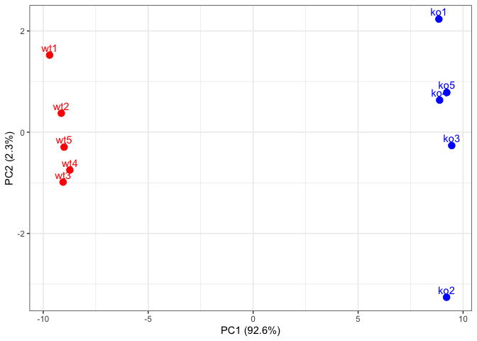

## Optional Gene Loadings

> For demonstration purposes let’s find the top 10 measurements (genes)
> that contribute most to pc1 in either direction (+ or -).

``` r
loading_scores <- pca$rotation[,1]

## Find the top 10 measurements (genes) that contribute
## most to PC1 in either direction (+ or -)
gene_scores <- abs(loading_scores) 
gene_score_ranked <- sort(gene_scores, decreasing=TRUE)

## show the names of the top 10 genes
top_10_genes <- names(gene_score_ranked[1:10])
top_10_genes 
```

     [1] "gene100" "gene66"  "gene45"  "gene68"  "gene98"  "gene60"  "gene21" 
     [8] "gene56"  "gene10"  "gene90" 
