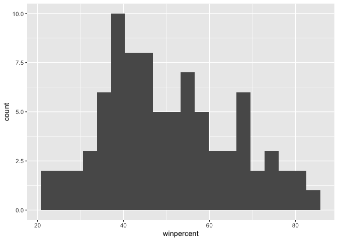
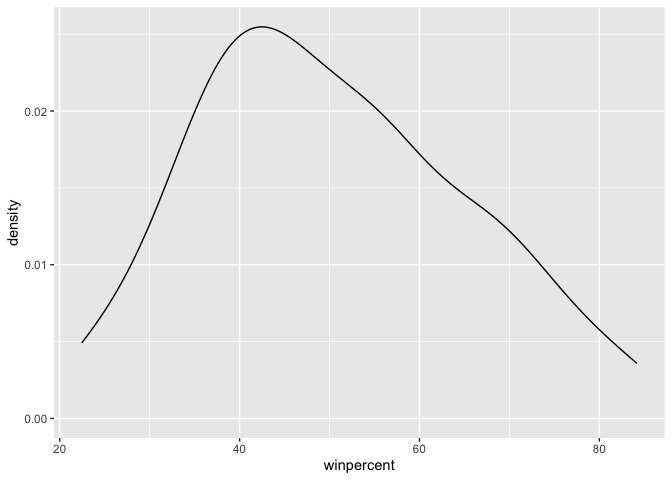
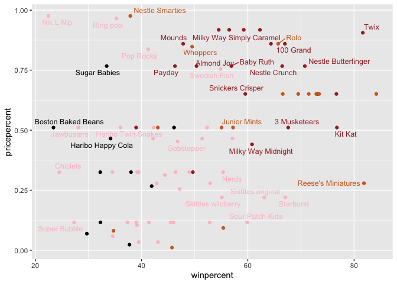
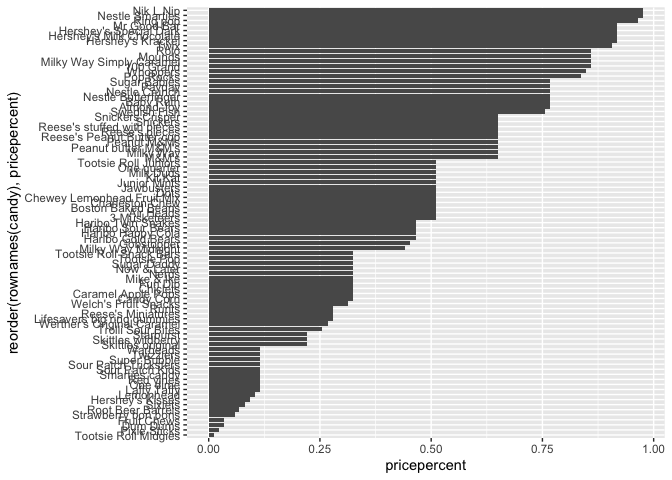
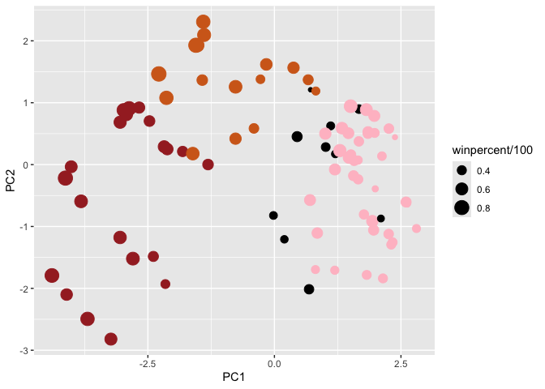
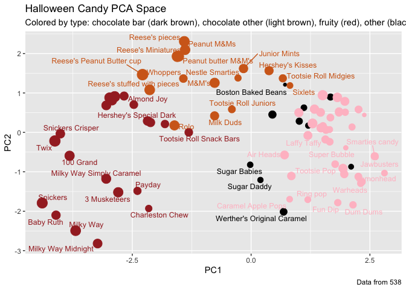
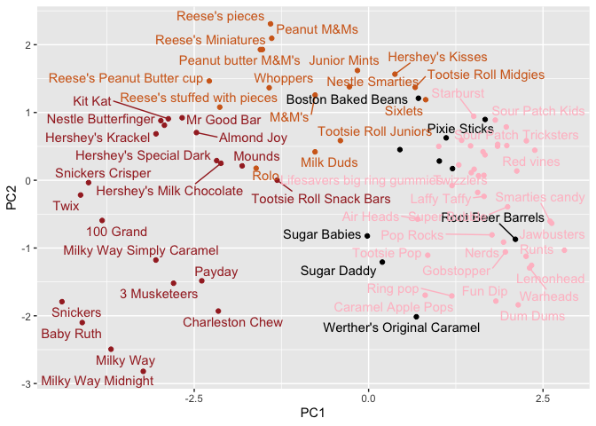
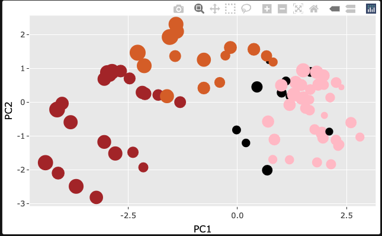
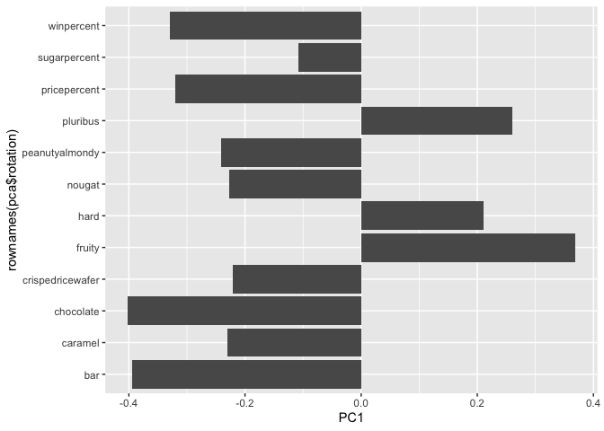

# Class 10: Halloween Mini-Project
Wade Ingersoll (PID: A69038080)

- [Background](#background)
- [1. Importing candy data](#1-importing-candy-data)
- [What is in the dataset?](#what-is-in-the-dataset)
- [2. What is your favorite candy?](#2-what-is-your-favorite-candy)
- [3. Overall Candy Rankings](#3-overall-candy-rankings)
- [Time to add some useful color](#time-to-add-some-useful-color)
- [4. Taking a look at pricepercent](#4-taking-a-look-at-pricepercent)
- [Optional](#optional)
- [5 Exploring the correlation
  structure](#5-exploring-the-correlation-structure)
- [6. Principal Component Analysis](#6-principal-component-analysis)

## Background

In this mini-project, you will explore FiveThirtyEight’s Halloween Candy
dataset. FiveThirtyEight, sometimes rendered as just 538, is an American
website that focuses mostly on opinion poll analysis, politics,
economics, and sports blogging. They recently ran a rather large poll to
determine which candy their readers like best. From their website:
*“While we don’t know who exactly voted, we do know this: 8,371
different IP addresses voted on about 269,000 randomly generated candy
matchups”.*

So what is the top ranked snack-sized Halloween candy? What made some
candies more desirable than others? Was it price? Maybe it was just
sugar content? Were they chocolate? Did they contain peanuts or almonds?
How about crisped rice or other biscuit-esque component, like a Kit Kat
or malted milk ball? Was it fruit flavored? Was it made of hard candy,
like a lollipop or a strawberry bon bon? Was there nougat? What even is
nougat? I know I like nougat, but I still have no real clue what the
damn thing is.

> Your task is to explore their candy dataset to find out answers to
> these types of questions - but most of all your job is to have fun,
> learn by doing hands on data analysis, and hopefully make this type of
> analysis less frightining for the future! **Let’s get started.**

## 1. Importing candy data

First things first, let’s get the data from the FiveThirtyEight GitHub
repo. You can either read from the URL directely or download this
candy-data.csv file and place it in your project directory. Either way
we need to load it up with `read.csv()` and inspect the data to see
exactly what we’re dealing with.

``` r
candy_file <- "candy-data.csv"

candy <- read.csv(candy_file, row.names=1)
head(candy)
```

                 chocolate fruity caramel peanutyalmondy nougat crispedricewafer
    100 Grand            1      0       1              0      0                1
    3 Musketeers         1      0       0              0      1                0
    One dime             0      0       0              0      0                0
    One quarter          0      0       0              0      0                0
    Air Heads            0      1       0              0      0                0
    Almond Joy           1      0       0              1      0                0
                 hard bar pluribus sugarpercent pricepercent winpercent
    100 Grand       0   1        0        0.732        0.860   66.97173
    3 Musketeers    0   1        0        0.604        0.511   67.60294
    One dime        0   0        0        0.011        0.116   32.26109
    One quarter     0   0        0        0.011        0.511   46.11650
    Air Heads       0   0        0        0.906        0.511   52.34146
    Almond Joy      0   1        0        0.465        0.767   50.34755

## What is in the dataset?

The dataset includes all sorts of information about different kinds of
candy. For example, is a candy chocolaty? Does it have nougat? How does
its cost compare to other candies? How many people prefer one candy over
another?

According to 538 the columns in the dataset include:

- **chocolate**: Does it contain chocolate?
- **fruity**: Is it fruit flavored?
- **caramel**: Is there caramel in the candy?
- **peanutyalmondy**: Does it contain peanuts, peanut butter or almonds?
- **nougat**: Does it contain nougat?
- **crispedricewafer**: Does it contain crisped rice, wafers, or a
  cookie component?
- **hard**: Is it a hard candy?
- **bar**: Is it a candy bar?
- **pluribus**: Is it one of many candies in a bag or box?
- **sugarpercent**: The percentile of sugar it falls under within the
  data set.
- **pricepercent**: The unit price percentile compared to the rest of
  the set.
- **winpercent**: The overall win percentage according to 269,000
  matchups (more on this in a moment).

> We will take a whirlwind tour of this dataset and in the process
> answer the questions highlighted in red throught this page that aim to
> guide your exploration process. We will then wrap up by trying
> Principal Component Analysis (PCA) on this dataset to get yet more
> experience with this important multivariate method. It will yield a
> kind of *“Map of Hallowen Candy Space”*. How cool is that! Let’s
> explore…

``` r
# Determine how many different candy types are in the dataset
nrow(candy)
```

    [1] 85

> **Q1:** How many different candy types are in this dataset?

> **Answer:** There are **85**; see above code chunk for calculations.

``` r
# Determine number of fruity candy in dataset
sum(candy$fruity)
```

    [1] 38

> **Q2:** How many fruity candy types are in the dataset?

> **Answer:** There are **38** fruity candy types; see above code chunk
> for calculations.

## 2. What is your favorite candy?

One of the most interesting variables in the dataset is `winpercent`.
For a given candy this value is the percentage of people who prefer this
candy over another randomly chosen candy from the dataset (what 538 term
a matchup). Higher values indicate a more popular candy.

We can find the `winpercent` value for Twix by using its name to access
the corresponding row of the dataset. This is because the dataset has
each candy name as `rownames` (recall that we set this when we imported
the original CSV file). For example the code for Twix is:

``` r
candy["Twix", ]$winpercent
```

    [1] 81.64291

``` r
candy["Milky Way", ]$winpercent
```

    [1] 73.09956

> **Q3:** What is your favorite candy in the dataset and what is it’s
> winpercent value?

> **Answer:** My favorite candy in the dataset is Milky Way and the
> winpercent value is **73.09956**; see above code chunk for
> calculations.

``` r
candy["Kit Kat", ]$winpercent
```

    [1] 76.7686

> **Q4:** What is the winpercent value for “Kit Kat”?

> **Answer:** The winpercent value for Kit Kat is **76.7686**; see above
> code chunk for calculations.

``` r
candy["Tootsie Roll Snack Bars", ]$winpercent
```

    [1] 49.6535

> **Q5:** What is the winpercent value for “Tootsie Roll Snack Bars”?

> **Answer:** The winpercent value for Tootsie Roll Snack Bars is
> **49.6535**; see above code chunk for calculations.

> Side-note: the `skimr::skim()` function

> There is a useful `skim()` function in the **skimr** package that can
> help give you a quick overview of a given dataset. Let’s install this
> package and try it on our candy data.

``` r
library("skimr")
skim(candy)
```

|                                                  |       |
|:-------------------------------------------------|:------|
| Name                                             | candy |
| Number of rows                                   | 85    |
| Number of columns                                | 12    |
| \_\_\_\_\_\_\_\_\_\_\_\_\_\_\_\_\_\_\_\_\_\_\_   |       |
| Column type frequency:                           |       |
| numeric                                          | 12    |
| \_\_\_\_\_\_\_\_\_\_\_\_\_\_\_\_\_\_\_\_\_\_\_\_ |       |
| Group variables                                  | None  |

Data summary

**Variable type: numeric**

| skim_variable | n_missing | complete_rate | mean | sd | p0 | p25 | p50 | p75 | p100 | hist |
|:---|---:|---:|---:|---:|---:|---:|---:|---:|---:|:---|
| chocolate | 0 | 1 | 0.44 | 0.50 | 0.00 | 0.00 | 0.00 | 1.00 | 1.00 | ▇▁▁▁▆ |
| fruity | 0 | 1 | 0.45 | 0.50 | 0.00 | 0.00 | 0.00 | 1.00 | 1.00 | ▇▁▁▁▆ |
| caramel | 0 | 1 | 0.16 | 0.37 | 0.00 | 0.00 | 0.00 | 0.00 | 1.00 | ▇▁▁▁▂ |
| peanutyalmondy | 0 | 1 | 0.16 | 0.37 | 0.00 | 0.00 | 0.00 | 0.00 | 1.00 | ▇▁▁▁▂ |
| nougat | 0 | 1 | 0.08 | 0.28 | 0.00 | 0.00 | 0.00 | 0.00 | 1.00 | ▇▁▁▁▁ |
| crispedricewafer | 0 | 1 | 0.08 | 0.28 | 0.00 | 0.00 | 0.00 | 0.00 | 1.00 | ▇▁▁▁▁ |
| hard | 0 | 1 | 0.18 | 0.38 | 0.00 | 0.00 | 0.00 | 0.00 | 1.00 | ▇▁▁▁▂ |
| bar | 0 | 1 | 0.25 | 0.43 | 0.00 | 0.00 | 0.00 | 0.00 | 1.00 | ▇▁▁▁▂ |
| pluribus | 0 | 1 | 0.52 | 0.50 | 0.00 | 0.00 | 1.00 | 1.00 | 1.00 | ▇▁▁▁▇ |
| sugarpercent | 0 | 1 | 0.48 | 0.28 | 0.01 | 0.22 | 0.47 | 0.73 | 0.99 | ▇▇▇▇▆ |
| pricepercent | 0 | 1 | 0.47 | 0.29 | 0.01 | 0.26 | 0.47 | 0.65 | 0.98 | ▇▇▇▇▆ |
| winpercent | 0 | 1 | 50.32 | 14.71 | 22.45 | 39.14 | 47.83 | 59.86 | 84.18 | ▃▇▆▅▂ |

From your use of the `skim()` function use the output to answer the
following:

> **Q6:** Is there any variable/column that looks to be on a different
> scale to the majority of the other columns in the dataset?

> **Answer:** winpercent looks to be on a different scale; its mean
> column is ~50 whereas the rest are ~0.1-0.4

> **Q7:** What do you think a zero and one represent for the
> `candy$chocolate` column?

> **Answer:** It likely means TRUE (1) or FALSE (0), i.e. whether the
> given candy is considered chocolately or not.

A good place to start any exploratory analysis is with a histogram. You
can do this most easily with the base R function `hist()`.
Alternatively, you can use `ggplot()` with `geom_hist()`. Either works
well in this case and (as always) its your choice.

> **Q8:** Plot a histogram of winpercent values (see below)

``` r
library(ggplot2)

ggplot(candy) +
  aes(winpercent) +
  geom_histogram(bins=20)
```



> **Q9:** Is the distribution of winpercent values symmetrical?

> **Answer:** No, the distribution is not symmetrical; see histogram
> above.

``` r
ggplot(candy) +
  aes(winpercent) +
  geom_density()
```



> **Q10:** Is the center of the distribution above or below 50%?

> **Answer:** It is **below** 50%

``` r
# Step 1. Find all chocolate candy in the dataset
choc.inds <- candy$chocolate==1
choc.candy <- candy[choc.inds,]
choc.candy
```

                                chocolate fruity caramel peanutyalmondy nougat
    100 Grand                           1      0       1              0      0
    3 Musketeers                        1      0       0              0      1
    Almond Joy                          1      0       0              1      0
    Baby Ruth                           1      0       1              1      1
    Charleston Chew                     1      0       0              0      1
    Hershey's Kisses                    1      0       0              0      0
    Hershey's Krackel                   1      0       0              0      0
    Hershey's Milk Chocolate            1      0       0              0      0
    Hershey's Special Dark              1      0       0              0      0
    Junior Mints                        1      0       0              0      0
    Kit Kat                             1      0       0              0      0
    Peanut butter M&M's                 1      0       0              1      0
    M&M's                               1      0       0              0      0
    Milk Duds                           1      0       1              0      0
    Milky Way                           1      0       1              0      1
    Milky Way Midnight                  1      0       1              0      1
    Milky Way Simply Caramel            1      0       1              0      0
    Mounds                              1      0       0              0      0
    Mr Good Bar                         1      0       0              1      0
    Nestle Butterfinger                 1      0       0              1      0
    Nestle Crunch                       1      0       0              0      0
    Peanut M&Ms                         1      0       0              1      0
    Reese's Miniatures                  1      0       0              1      0
    Reese's Peanut Butter cup           1      0       0              1      0
    Reese's pieces                      1      0       0              1      0
    Reese's stuffed with pieces         1      0       0              1      0
    Rolo                                1      0       1              0      0
    Sixlets                             1      0       0              0      0
    Nestle Smarties                     1      0       0              0      0
    Snickers                            1      0       1              1      1
    Snickers Crisper                    1      0       1              1      0
    Tootsie Pop                         1      1       0              0      0
    Tootsie Roll Juniors                1      0       0              0      0
    Tootsie Roll Midgies                1      0       0              0      0
    Tootsie Roll Snack Bars             1      0       0              0      0
    Twix                                1      0       1              0      0
    Whoppers                            1      0       0              0      0
                                crispedricewafer hard bar pluribus sugarpercent
    100 Grand                                  1    0   1        0        0.732
    3 Musketeers                               0    0   1        0        0.604
    Almond Joy                                 0    0   1        0        0.465
    Baby Ruth                                  0    0   1        0        0.604
    Charleston Chew                            0    0   1        0        0.604
    Hershey's Kisses                           0    0   0        1        0.127
    Hershey's Krackel                          1    0   1        0        0.430
    Hershey's Milk Chocolate                   0    0   1        0        0.430
    Hershey's Special Dark                     0    0   1        0        0.430
    Junior Mints                               0    0   0        1        0.197
    Kit Kat                                    1    0   1        0        0.313
    Peanut butter M&M's                        0    0   0        1        0.825
    M&M's                                      0    0   0        1        0.825
    Milk Duds                                  0    0   0        1        0.302
    Milky Way                                  0    0   1        0        0.604
    Milky Way Midnight                         0    0   1        0        0.732
    Milky Way Simply Caramel                   0    0   1        0        0.965
    Mounds                                     0    0   1        0        0.313
    Mr Good Bar                                0    0   1        0        0.313
    Nestle Butterfinger                        0    0   1        0        0.604
    Nestle Crunch                              1    0   1        0        0.313
    Peanut M&Ms                                0    0   0        1        0.593
    Reese's Miniatures                         0    0   0        0        0.034
    Reese's Peanut Butter cup                  0    0   0        0        0.720
    Reese's pieces                             0    0   0        1        0.406
    Reese's stuffed with pieces                0    0   0        0        0.988
    Rolo                                       0    0   0        1        0.860
    Sixlets                                    0    0   0        1        0.220
    Nestle Smarties                            0    0   0        1        0.267
    Snickers                                   0    0   1        0        0.546
    Snickers Crisper                           1    0   1        0        0.604
    Tootsie Pop                                0    1   0        0        0.604
    Tootsie Roll Juniors                       0    0   0        0        0.313
    Tootsie Roll Midgies                       0    0   0        1        0.174
    Tootsie Roll Snack Bars                    0    0   1        0        0.465
    Twix                                       1    0   1        0        0.546
    Whoppers                                   1    0   0        1        0.872
                                pricepercent winpercent
    100 Grand                          0.860   66.97173
    3 Musketeers                       0.511   67.60294
    Almond Joy                         0.767   50.34755
    Baby Ruth                          0.767   56.91455
    Charleston Chew                    0.511   38.97504
    Hershey's Kisses                   0.093   55.37545
    Hershey's Krackel                  0.918   62.28448
    Hershey's Milk Chocolate           0.918   56.49050
    Hershey's Special Dark             0.918   59.23612
    Junior Mints                       0.511   57.21925
    Kit Kat                            0.511   76.76860
    Peanut butter M&M's                0.651   71.46505
    M&M's                              0.651   66.57458
    Milk Duds                          0.511   55.06407
    Milky Way                          0.651   73.09956
    Milky Way Midnight                 0.441   60.80070
    Milky Way Simply Caramel           0.860   64.35334
    Mounds                             0.860   47.82975
    Mr Good Bar                        0.918   54.52645
    Nestle Butterfinger                0.767   70.73564
    Nestle Crunch                      0.767   66.47068
    Peanut M&Ms                        0.651   69.48379
    Reese's Miniatures                 0.279   81.86626
    Reese's Peanut Butter cup          0.651   84.18029
    Reese's pieces                     0.651   73.43499
    Reese's stuffed with pieces        0.651   72.88790
    Rolo                               0.860   65.71629
    Sixlets                            0.081   34.72200
    Nestle Smarties                    0.976   37.88719
    Snickers                           0.651   76.67378
    Snickers Crisper                   0.651   59.52925
    Tootsie Pop                        0.325   48.98265
    Tootsie Roll Juniors               0.511   43.06890
    Tootsie Roll Midgies               0.011   45.73675
    Tootsie Roll Snack Bars            0.325   49.65350
    Twix                               0.906   81.64291
    Whoppers                           0.848   49.52411

``` r
# Step 2. Extract their `winpercent` values
choc.win <- choc.candy$winpercent
choc.win
```

     [1] 66.97173 67.60294 50.34755 56.91455 38.97504 55.37545 62.28448 56.49050
     [9] 59.23612 57.21925 76.76860 71.46505 66.57458 55.06407 73.09956 60.80070
    [17] 64.35334 47.82975 54.52645 70.73564 66.47068 69.48379 81.86626 84.18029
    [25] 73.43499 72.88790 65.71629 34.72200 37.88719 76.67378 59.52925 48.98265
    [33] 43.06890 45.73675 49.65350 81.64291 49.52411

``` r
# Step 3. Find the mean of these values
choc.mean <- mean(choc.win)

# Step 4-6. Do the same for fruity candy
fruity.inds <- candy$fruity==1
fruity.candy <- candy[fruity.inds,]
fruity.win <- fruity.candy$winpercent
fruity.mean <- mean(fruity.win)

# Step 7. Which mean value is higher

choc.mean
```

    [1] 60.92153

``` r
fruity.mean
```

    [1] 44.11974

``` r
# chocolate is higher
```

> **Q11:** On average is chocolate candy higher or lower ranked than
> fruit candy?

> **Answer:** Chocolate (60.92153) is higher ranked than fruit
> (44.11974). See above code chunk for calculations.

``` r
t.test(choc.win, fruity.win)
```


        Welch Two Sample t-test

    data:  choc.win and fruity.win
    t = 6.2582, df = 68.882, p-value = 2.871e-08
    alternative hypothesis: true difference in means is not equal to 0
    95 percent confidence interval:
     11.44563 22.15795
    sample estimates:
    mean of x mean of y 
     60.92153  44.11974 

> **Q12:** Is this difference statistically significant?

> **Answer:** Yes (p-value = 2.871e-08); see above code chunk for
> calculations.

## 3. Overall Candy Rankings

Let’s use the base R `order()` function together with `head()` to sort
the whole dataset by `winpercent`. Or if you have been getting into the
tidyverse and the **dplyr** package you can use the `arrange()` function
together with `head()` to do the same thing and answer the following
questions:

``` r
head(candy[order(candy$winpercent),], n=5)
```

                       chocolate fruity caramel peanutyalmondy nougat
    Nik L Nip                  0      1       0              0      0
    Boston Baked Beans         0      0       0              1      0
    Chiclets                   0      1       0              0      0
    Super Bubble               0      1       0              0      0
    Jawbusters                 0      1       0              0      0
                       crispedricewafer hard bar pluribus sugarpercent pricepercent
    Nik L Nip                         0    0   0        1        0.197        0.976
    Boston Baked Beans                0    0   0        1        0.313        0.511
    Chiclets                          0    0   0        1        0.046        0.325
    Super Bubble                      0    0   0        0        0.162        0.116
    Jawbusters                        0    1   0        1        0.093        0.511
                       winpercent
    Nik L Nip            22.44534
    Boston Baked Beans   23.41782
    Chiclets             24.52499
    Super Bubble         27.30386
    Jawbusters           28.12744

> **Q13:** What are the five least liked candy types in this set?

> **Answer:** Nik L Nip, Boston Baked Beans, Chiclets, Super Bubble, and
> Jawbusters. See above code chunk.

``` r
head(candy[order(candy$winpercent, decreasing = TRUE),], n=5)
```

                              chocolate fruity caramel peanutyalmondy nougat
    Reese's Peanut Butter cup         1      0       0              1      0
    Reese's Miniatures                1      0       0              1      0
    Twix                              1      0       1              0      0
    Kit Kat                           1      0       0              0      0
    Snickers                          1      0       1              1      1
                              crispedricewafer hard bar pluribus sugarpercent
    Reese's Peanut Butter cup                0    0   0        0        0.720
    Reese's Miniatures                       0    0   0        0        0.034
    Twix                                     1    0   1        0        0.546
    Kit Kat                                  1    0   1        0        0.313
    Snickers                                 0    0   1        0        0.546
                              pricepercent winpercent
    Reese's Peanut Butter cup        0.651   84.18029
    Reese's Miniatures               0.279   81.86626
    Twix                             0.906   81.64291
    Kit Kat                          0.511   76.76860
    Snickers                         0.651   76.67378

> **Q14:** What are the top 5 all time favorite candy types out of this
> set?

> **Answer:** Reese’s Peanut Butter Cup, Reese’s Miniatures, Twix, Kit
> Kat, and Snickers. See above code chunk.

To examine more of the dataset in this vain we can make a barplot to
visualize the overall rankings. We will use an iterative approach to
building a useful visulization by getting a rough starting plot and then
refining and adding useful details in a stepwise process.

> **Q15:** Make a first barplot of candy ranking based on winpercent
> values.

``` r
library(ggplot2)

ggplot(candy) + 
  aes(winpercent, rownames(candy)) + 
  geom_col()
```


> **Q16:** This is quite ugly, use the `reorder()` function to get the
> bars sorted by winpercent?

``` r
ggplot(candy) + 
  aes(winpercent, reorder( rownames(candy), winpercent)) + 
  geom_col()
```


## Time to add some useful color

Let’s setup a color vector (that signifies candy type) that we can then
use for some future plots. We start by making a vector of all black
values (one for each candy). Then we overwrite chocolate (for chocolate
candy), brown (for candy bars) and red (for fruity candy) values.

Now let’s try our barplot with these colors. Note that we use
`fill=my_cols` for `geom_col()`. Experiment to see what happens if you
use `col=mycols`.

``` r
my_cols <- rep("black", nrow(candy))
my_cols[candy$chocolate==1] <- "chocolate"
my_cols[candy$bar==1] <- "brown"
my_cols[candy$fruity==1] <- "pink"

ggplot(candy) + 
  aes(x=winpercent, 
      y=reorder( rownames(candy), winpercent)) + 
  geom_col(fill=my_cols)
```


Now, for the first time, using this plot we can answer questions like:
\> **Q17:** What is the worst ranked chocolate candy? - **Sixlets** \>
**Q18:** What is the best ranked fruity candy? - **Starburst**

## 4. Taking a look at pricepercent

What about value for money? What is the the best candy for the least
money? One way to get at this would be to make a plot of `winpercent` vs
the `pricepercent` variable. The `pricepercent` variable records the
percentile rank of the candy’s price against all the other candies in
the dataset. Lower vales are less expensive and high values more
expensive.

To this plot we will add text labels so we can more easily identify a
given candy. There is a regular `geom_label()` that comes with ggplot2.
However, as there are quite a few candys in our dataset lots of these
labels will be overlapping and hard to read. To help with this we can
use the `geom_text_repel()` function from the **ggrepel** package.

``` r
library(ggrepel)

# How about a plot of price vs win
ggplot(candy) +
  aes(winpercent, pricepercent, label=rownames(candy)) +
  geom_point(col=my_cols) + 
  geom_text_repel(col=my_cols, size=3.3, max.overlaps = 5)
```

    Warning: ggrepel: 50 unlabeled data points (too many overlaps). Consider
    increasing max.overlaps



``` r
ord <- order(candy$pricepercent, decreasing = TRUE)
head( candy[ord,c(11,12)], n=5 )
```

                             pricepercent winpercent
    Nik L Nip                       0.976   22.44534
    Nestle Smarties                 0.976   37.88719
    Ring pop                        0.965   35.29076
    Hershey's Krackel               0.918   62.28448
    Hershey's Milk Chocolate        0.918   56.49050

> **Q19:** Which candy type is the highest ranked in terms of winpercent
> for the least money - i.e. offers the most bang for your buck?

> **Answer:** Either **Reese’s Miniatures** or **Reese’s Peanut Butter
> cup** , depending on what you consider too high of a price.

> **Q20:** What are the top 5 most expensive candy types in the dataset
> and of these which is the least popular? - **Nik L Nip**

## Optional

> **Q21:** Make a barplot again with `geom_col()` this time using
> `pricepercent` and then improve this step by step, first ordering the
> x-axis by value and finally making a so called “dot chat” or
> “lollipop” chart by swapping `geom_col()` for `geom_point()` +
> `geom_segment()`.

``` r
ggplot(candy) + 
  aes(pricepercent, reorder( rownames(candy), pricepercent)) + 
  geom_col()
```



``` r
# Make a lollipop chart of pricepercent
ggplot(candy) +
  aes(pricepercent, reorder(rownames(candy), pricepercent)) +
  geom_segment(aes(yend = reorder(rownames(candy), pricepercent), 
                   xend = 0), col="gray40") +
    geom_point()
```


## 5 Exploring the correlation structure

Now that we’ve explored the dataset a little, we’ll see how the
variables interact with one another. We’ll use correlation and view the
results with the **corrplot** package to plot a correlation matrix.

``` r
library(corrplot)
```

    corrplot 0.95 loaded

``` r
cij <- cor(candy)
corrplot(cij)
```


> **Q22:** Examining this plot what two variables are anti-correlated
> (i.e. have minus values)? - **Chocolate vs. Fruity**

> **Q23:** Similarly, what two variables are most positively correlated?

> **Answer:** **Chocolate vs. Chocolate**, in fact, all the same type
> comparisons are the most positively correlated; notice the diagonal.

## 6. Principal Component Analysis

Let’s apply PCA using the `prcom()` function to our candy dataset
remembering to set the `scale=TRUE` argument.

> **Side-note:** Feel free to examine what happens if you leave this
> argument out (i.e. use the default `scale=FALSE`). Then examine the
> `summary(pca)` and `pca$rotation[,1]` component and see that it is
> dominated by `winpercent` (which is after all measured on a very
> different scale than the other variables).

``` r
pca <- prcomp(candy, scale=TRUE)
summary(pca)
```

    Importance of components:
                              PC1    PC2    PC3     PC4    PC5     PC6     PC7
    Standard deviation     2.0788 1.1378 1.1092 1.07533 0.9518 0.81923 0.81530
    Proportion of Variance 0.3601 0.1079 0.1025 0.09636 0.0755 0.05593 0.05539
    Cumulative Proportion  0.3601 0.4680 0.5705 0.66688 0.7424 0.79830 0.85369
                               PC8     PC9    PC10    PC11    PC12
    Standard deviation     0.74530 0.67824 0.62349 0.43974 0.39760
    Proportion of Variance 0.04629 0.03833 0.03239 0.01611 0.01317
    Cumulative Proportion  0.89998 0.93832 0.97071 0.98683 1.00000

Now we can plot our main PCA score plot of PC1 vs PC2.

``` r
plot(pca$x[, 1:2])
```


We can change the plotting character and add some color:

``` r
plot(pca$x[,1:2], col=my_cols, pch=16)
```


We can make a much nicer plot with the **ggplot2** package but it is
important to note that ggplot works best when you supply an input
data.frame that includes a separate column for each of the aesthetics
you would like displayed in your final plot. To accomplish this we make
a new data.frame here that contains our PCA results with all the rest of
our candy data. We will then use this for making plots below

``` r
# Make a new data-frame with our PCA results and candy data
my_data <- cbind(candy, pca$x[,1:3])
```

``` r
p <- ggplot(my_data) + 
        aes(x=PC1, y=PC2, 
            size=winpercent/100,  
            text=rownames(my_data),
            label=rownames(my_data)) +
        geom_point(col=my_cols)

p
```



Again we can use the **ggrepel** package and the function
`ggrepel::geom_text_repel()` to label up the plot with non overlapping
candy names like. We will also add a title and subtitle like so:

``` r
library(ggrepel)

p + geom_text_repel(size=3.3, col=my_cols, max.overlaps = 7)  + 
  theme(legend.position = "none") +
  labs(title="Halloween Candy PCA Space",
       subtitle="Colored by type: chocolate bar (dark brown), chocolate other (light brown), fruity (red), other (black)",
       caption="Data from 538")
```

    Warning: ggrepel: 39 unlabeled data points (too many overlaps). Consider
    increasing max.overlaps



If you want to see more candy labels you can change the `max.overlaps`
value to allow more overlapping labels or pass the ggplot object `p` to
**plotly** like so to generate an interactive plot that you can mouse
over to see labels:

``` r
library(ggrepel)
ggplot(pca$x) + 
  aes(PC1, PC2, label=rownames(pca$x)) + 
  geom_point(col=my_cols) +
  geom_text_repel(col=my_cols)
```

    Warning: ggrepel: 21 unlabeled data points (too many overlaps). Consider
    increasing max.overlaps



``` r
library(plotly)
```


    Attaching package: 'plotly'

    The following object is masked from 'package:ggplot2':

        last_plot

    The following object is masked from 'package:stats':

        filter

    The following object is masked from 'package:graphics':

        layout

``` r
#ggplotly(p)
# Document would not render with plotly chart so I inserted png of the plot
```

 Let’s finish by taking a quick look at PCA our loadings.
Do these make sense to you? Notice the opposite effects of `chocolate`
and `fruity` and the similar effects of `chocolate` and `bar` (i.e. we
already know they are correlated).

``` r
par(mar=c(8,4,2,2))
barplot(pca$rotation[,1], las=2, ylab="PC1 Contribution")
```


``` r
# Using ggplot
ggplot(pca$rotation) + 
  aes(PC1, rownames(pca$rotation)) + 
  geom_col()
```



> **Q24:** What original variables are picked up strongly by PC1 in the
> positive direction? Do these make sense to you?

> **Answer:** Fruity, hard, an pluribus are picked up by PC1 in the
> positive direction. This makes sense to me; I’m thinking of hard
> candies.
