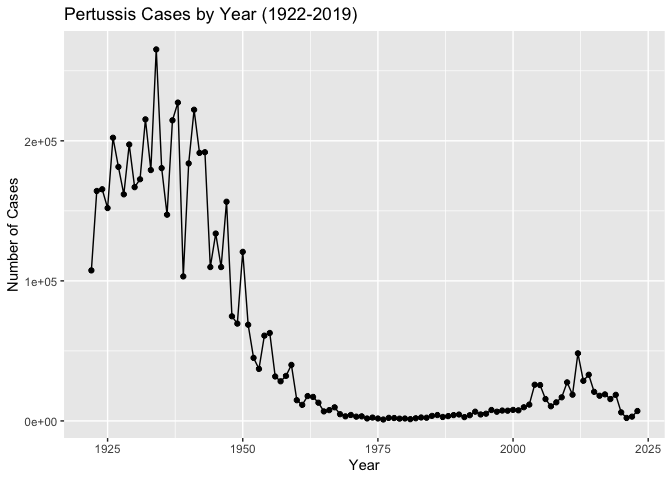
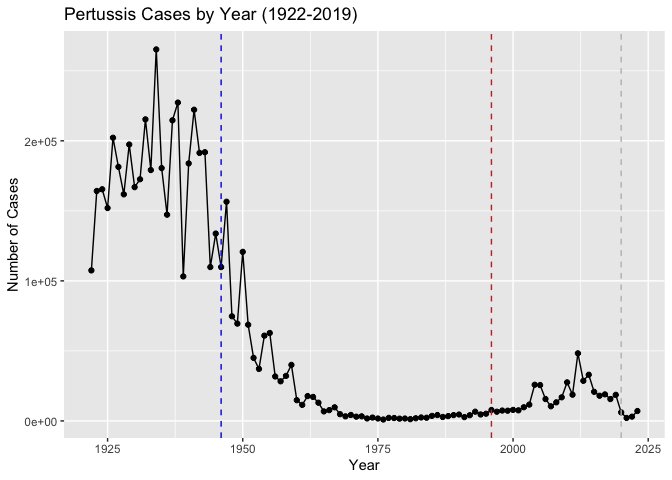
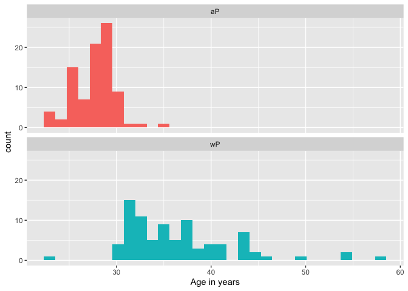
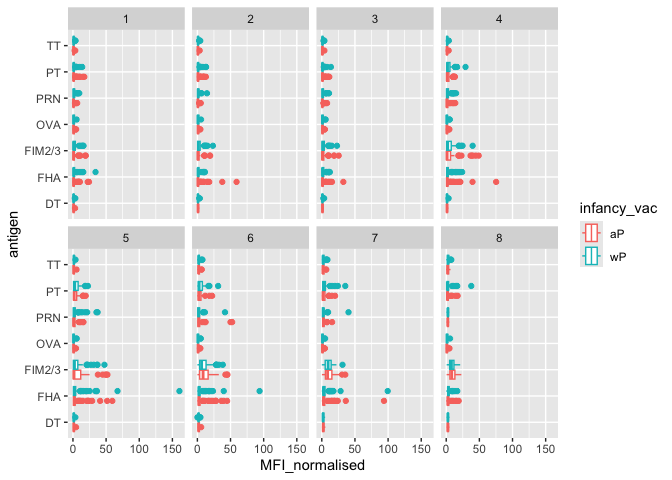

# Class 19: Investigating Pertussis
Wade Ingersoll (PID: A69038080)

- [Background](#background)
- [The CMI-PB project](#the-cmi-pb-project)
  - [Side-Note: Working with dates](#side-note-working-with-dates)
  - [Joining multiple tables](#joining-multiple-tables)
- [4. Examine IgG Ab titer levels](#4-examine-igg-ab-titer-levels)

## Background

Pertussis (a.k.a. Whooping cough) is a highly contagious lung infection
caused by the bacteria *B. pertussis*.

The CDC tracks case numbers in the US and makes this data available
online \> **Q1:** With the help of the R “addin” package `datapasta`
assign the CDC pertussis case number data to a data frame called **cdc**
and use **ggplot** to make a plot of cases numbers over time.

``` r
library(ggplot2)

ggplot(cdc) + 
  aes(year, cases) +
  geom_point() +
  geom_line() +
  labs(x="Year", y="Number of Cases", title = "Pertussis Cases by Year (1922-2019)")
```





> **Q2:** Using the ggplot `geom_vline()` function add lines to your
> previous plot for the 1946 introduction of the wP vaccine and the 1996
> switch to aP vaccine (see example in the hint below). What do you
> notice? Finally, add a line for 2020.

> **Answer:** I noticed that approximately 10 years after switching to
> the aP vaccine, cases began to rise.

> **Q2.1:** Describe what happened after the introduction of the aP
> vaccine? Do you have a possible explanation for the observed trend?

> **Answer:** After introduction of the aP vaccine, the number of cases
> increased. This could be due to aP’s decreased ability to confer
> lasting immunity compared to wP.

``` r
ggplot(cdc) + 
  aes(year, cases) +
  geom_point() +
  geom_line() +
  geom_vline(xintercept = 1946, col="blue", linetype="dashed") +
  geom_vline(xintercept = 1996, col="red", linetype="dashed") +
  geom_vline(xintercept = 2020, col="grey", linetype="dashed") +
  labs(x="Year", y="Number of Cases", title = "Pertussis Cases by Year (1922-2019)")
```





## The CMI-PB project

The CMI-Pertussis Boost (PB) project focuses on gathering data on this
very topic. What is distinct between aP and wP individuals over time
when they encounter Pertussis again.

They make their data available via a JSON format returning API. We can
read JSON format with the `read_json()` function from the **jsonlite**
package with `install.packages("jsonlite")`

``` r
library(jsonlite)
subject <- read_json("http://cmi-pb.org/api/v5_1/subject", simplifyVector = TRUE)
head(subject)
```

      subject_id infancy_vac biological_sex              ethnicity  race
    1          1          wP         Female Not Hispanic or Latino White
    2          2          wP         Female Not Hispanic or Latino White
    3          3          wP         Female                Unknown White
    4          4          wP           Male Not Hispanic or Latino Asian
    5          5          wP           Male Not Hispanic or Latino Asian
    6          6          wP         Female Not Hispanic or Latino White
      year_of_birth date_of_boost      dataset
    1    1986-01-01    2016-09-12 2020_dataset
    2    1968-01-01    2019-01-28 2020_dataset
    3    1983-01-01    2016-10-10 2020_dataset
    4    1988-01-01    2016-08-29 2020_dataset
    5    1991-01-01    2016-08-29 2020_dataset
    6    1988-01-01    2016-10-10 2020_dataset

> **Q3:** How many “subjects” (or individuals) are in this dataset?

> **Answer:** 172 (see code below for calculations)

``` r
nrow(subject)
```

    [1] 172



> **Q4:** How many aP and wP infancy vaccinated subjects are in the
> dataset?

> **Answer:** There are 87 aP and 85 wP (see code below for
> calculations)

``` r
table(subject$infancy_vac)
```


    aP wP 
    87 85 

> **Q5:** How many Male and Female subjects/patients are in the dataset?

> **Answer:** There are 112 females and 60 males (see code below for
> calculations)

``` r
table(subject$biological_sex)
```


    Female   Male 
       112     60 

> **Q6:** What is the breakdown of race and biological sex (e.g. number
> of Asian females, White males etc…)?

> **Answer:** See code below for breakdown

``` r
table(subject$race, subject$biological_sex)
```

                                               
                                                Female Male
      American Indian/Alaska Native                  0    1
      Asian                                         32   12
      Black or African American                      2    3
      More Than One Race                            15    4
      Native Hawaiian or Other Pacific Islander      1    1
      Unknown or Not Reported                       14    7
      White                                         48   32



### Side-Note: Working with dates

Two of the columns of `subject` contain dates in the Year-Month-Day
format. Recall from our last mini-project that dates and times can be
annoying to work with at the best of times. However, in R we have the
excellent lubridate package, which can make life allot easier. Here is a
quick example to get you started:

``` r
library(lubridate)
```


    Attaching package: 'lubridate'

    The following objects are masked from 'package:base':

        date, intersect, setdiff, union

What is today’s date (at the time I am writing this obviously)

``` r
today()
```

    [1] "2025-12-07"

How many days have passed since new year 2000

``` r
today() - ymd("2000-01-01")
```

    Time difference of 9472 days

What is this in years?

``` r
time_length( today() - ymd("2000-01-01"),  "years")
```

    [1] 25.93292



Note that here we are using the `ymd()` function to tell lubridate the
format of our particular date and then the `time_length()` function to
convert days to years.

> **Q7:** Using this approach determine (i) the average age of wP
> individuals, (ii) the average age of aP individuals; and (iii) are
> they significantly different?

> **Answer:** The average age of **wP = 37** and **aP = 28**. These
> values are statistically significant with a **p-value of
> 2.372101e-23**. See code below for calculations.

``` r
# Using ymd() function on the appropriate column of our subject data frame together with today’s date we can calculate the age in days for subjects. We can optionally store this back into our subject data frame for later use:

subject$age <- today() - ymd(subject$year_of_birth)
```

``` r
library(dplyr)
```


    Attaching package: 'dplyr'

    The following objects are masked from 'package:stats':

        filter, lag

    The following objects are masked from 'package:base':

        intersect, setdiff, setequal, union

``` r
# Next we can use dplyr’s filter() function to limit ourselves to a particular subset of subjects to examine the 6 number summary of their age in years:

ap <- subject %>% filter(infancy_vac == "aP")

round( summary( time_length( ap$age, "years" ) ) )
```

       Min. 1st Qu.  Median    Mean 3rd Qu.    Max. 
         23      27      28      28      29      35 

``` r
# wP
wp <- subject %>% filter(infancy_vac == "wP")
round( summary( time_length( wp$age, "years" ) ) )
```

       Min. 1st Qu.  Median    Mean 3rd Qu.    Max. 
         23      33      35      37      40      58 

``` r
# Are they significantly different?
t <- t.test(ap$age, wp$age)
t$p.value
```

    Time difference of 2.372101e-23 days

> **Q8:** Determine the age of all individuals at time of boost?

> **Answer:** See code below for calculations

``` r
int <- ymd(subject$date_of_boost) - ymd(subject$year_of_birth)
age_at_boost <- time_length(int, "year")
subject$age_at_boost <- age_at_boost
head(subject)
```

      subject_id infancy_vac biological_sex              ethnicity  race
    1          1          wP         Female Not Hispanic or Latino White
    2          2          wP         Female Not Hispanic or Latino White
    3          3          wP         Female                Unknown White
    4          4          wP           Male Not Hispanic or Latino Asian
    5          5          wP           Male Not Hispanic or Latino Asian
    6          6          wP         Female Not Hispanic or Latino White
      year_of_birth date_of_boost      dataset        age age_at_boost
    1    1986-01-01    2016-09-12 2020_dataset 14585 days     30.69678
    2    1968-01-01    2019-01-28 2020_dataset 21160 days     51.07461
    3    1983-01-01    2016-10-10 2020_dataset 15681 days     33.77413
    4    1988-01-01    2016-08-29 2020_dataset 13855 days     28.65982
    5    1991-01-01    2016-08-29 2020_dataset 12759 days     25.65914
    6    1988-01-01    2016-10-10 2020_dataset 13855 days     28.77481



> **Q9a:** With the help of a faceted boxplot or histogram (see below),
> do you think these two groups are significantly different?

> **Answer:** These groups definitely seem different. This observation
> is supported by a t-test p-value of **2.372101e-23**

``` r
ggplot(subject) +
  aes(time_length(age, "year"),
      fill=as.factor(infancy_vac)) +
  geom_histogram(show.legend=FALSE) +
  facet_wrap(vars(infancy_vac), nrow=2) +
  xlab("Age in years")
```

    `stat_bin()` using `bins = 30`. Pick better value `binwidth`.



``` r
x <- t.test(time_length( wp$age, "years" ),
       time_length( ap$age, "years" ))

x$p.value
```

    [1] 2.372101e-23

### Joining multiple tables

Read the specimen and ab_titer tables into R and store the data as
`specimen` and `titer` named data frames.

``` r
# Complete the API URLs...
specimen <- read_json("http://cmi-pb.org/api/v5_1/specimen", simplifyVector = TRUE)
ab_titer <- read_json("http://cmi-pb.org/api/v5_1/plasma_ab_titer", simplifyVector = TRUE)
```

To know whether a given `specimen_id` comes from an aP or wP individual
we need to link (a.k.a. “join” or merge) our `specimen` and `subject`
data frames. The excellent **dplyr** package (that we have used
previously) has a family of `join()` functions that can help us with
this common task:

> **Q9b:** Complete the code to join specimen and subject tables to make
> a new merged data frame containing all specimen records along with
> their associated subject details:

``` r
meta <- inner_join(specimen, subject)
```

    Joining with `by = join_by(subject_id)`

``` r
dim(meta)
```

    [1] 1503   15

``` r
head(meta)
```

      specimen_id subject_id actual_day_relative_to_boost
    1           1          1                           -3
    2           2          1                            1
    3           3          1                            3
    4           4          1                            7
    5           5          1                           11
    6           6          1                           32
      planned_day_relative_to_boost specimen_type visit infancy_vac biological_sex
    1                             0         Blood     1          wP         Female
    2                             1         Blood     2          wP         Female
    3                             3         Blood     3          wP         Female
    4                             7         Blood     4          wP         Female
    5                            14         Blood     5          wP         Female
    6                            30         Blood     6          wP         Female
                   ethnicity  race year_of_birth date_of_boost      dataset
    1 Not Hispanic or Latino White    1986-01-01    2016-09-12 2020_dataset
    2 Not Hispanic or Latino White    1986-01-01    2016-09-12 2020_dataset
    3 Not Hispanic or Latino White    1986-01-01    2016-09-12 2020_dataset
    4 Not Hispanic or Latino White    1986-01-01    2016-09-12 2020_dataset
    5 Not Hispanic or Latino White    1986-01-01    2016-09-12 2020_dataset
    6 Not Hispanic or Latino White    1986-01-01    2016-09-12 2020_dataset
             age age_at_boost
    1 14585 days     30.69678
    2 14585 days     30.69678
    3 14585 days     30.69678
    4 14585 days     30.69678
    5 14585 days     30.69678
    6 14585 days     30.69678



> **Q10:** Now using the same procedure join meta with titer data so we
> can further analyze this data in terms of time of visit aP/wP,
> male/female etc.

``` r
abdata <- inner_join(ab_titer, meta)
```

    Joining with `by = join_by(specimen_id)`

``` r
dim(abdata)
```

    [1] 61956    22

> **Q11:** How many specimens (i.e. entries in `abdata`) do we have for
> each `isotype`?

> **Answer:** See code below for answer

``` r
table(abdata$isotype)
```


      IgE   IgG  IgG1  IgG2  IgG3  IgG4 
     6698  7265 11993 12000 12000 12000 

> **Q12:** What are the different \$dataset values in abdata and what do
> you notice about the number of rows for the most “recent” dataset?

> **Answer:** For the most recent dataset (2023), the number of rows
> increased compared to the two previous years. See code below for other
> \$dataset values.

``` r
table(abdata$dataset)
```


    2020_dataset 2021_dataset 2022_dataset 2023_dataset 
           31520         8085         7301        15050 



## 4. Examine IgG Ab titer levels

Now using our joined/merged/linked `abdata` dataset `filter()` for IgG
`isotype`.

``` r
igg <- abdata %>% filter(isotype == "IgG")
head(igg)
```

      specimen_id isotype is_antigen_specific antigen        MFI MFI_normalised
    1           1     IgG                TRUE      PT   68.56614       3.736992
    2           1     IgG                TRUE     PRN  332.12718       2.602350
    3           1     IgG                TRUE     FHA 1887.12263      34.050956
    4          19     IgG                TRUE      PT   20.11607       1.096366
    5          19     IgG                TRUE     PRN  976.67419       7.652635
    6          19     IgG                TRUE     FHA   60.76626       1.096457
       unit lower_limit_of_detection subject_id actual_day_relative_to_boost
    1 IU/ML                 0.530000          1                           -3
    2 IU/ML                 6.205949          1                           -3
    3 IU/ML                 4.679535          1                           -3
    4 IU/ML                 0.530000          3                           -3
    5 IU/ML                 6.205949          3                           -3
    6 IU/ML                 4.679535          3                           -3
      planned_day_relative_to_boost specimen_type visit infancy_vac biological_sex
    1                             0         Blood     1          wP         Female
    2                             0         Blood     1          wP         Female
    3                             0         Blood     1          wP         Female
    4                             0         Blood     1          wP         Female
    5                             0         Blood     1          wP         Female
    6                             0         Blood     1          wP         Female
                   ethnicity  race year_of_birth date_of_boost      dataset
    1 Not Hispanic or Latino White    1986-01-01    2016-09-12 2020_dataset
    2 Not Hispanic or Latino White    1986-01-01    2016-09-12 2020_dataset
    3 Not Hispanic or Latino White    1986-01-01    2016-09-12 2020_dataset
    4                Unknown White    1983-01-01    2016-10-10 2020_dataset
    5                Unknown White    1983-01-01    2016-10-10 2020_dataset
    6                Unknown White    1983-01-01    2016-10-10 2020_dataset
             age age_at_boost
    1 14585 days     30.69678
    2 14585 days     30.69678
    3 14585 days     30.69678
    4 15681 days     33.77413
    5 15681 days     33.77413
    6 15681 days     33.77413



> **Q13:** Complete the following code to make a summary boxplot of Ab
> titer levels (MFI) for all antigens:

``` r
ggplot(igg) +
  aes(MFI_normalised, antigen) +
  geom_boxplot() + 
    xlim(0,75) +
  facet_wrap(vars(visit), nrow=2)
```

    Warning: Removed 5 rows containing non-finite outside the scale range
    (`stat_boxplot()`).




> **Q14:** Antigen levels time-course plot

``` r
abdata.21 <- abdata %>% filter(dataset == "2021_dataset")

abdata.21 %>% 
  filter(isotype == "IgG",  antigen == "PT") %>%
  ggplot() +
    aes(x=planned_day_relative_to_boost,
        y=MFI_normalised,
        col=infancy_vac,
        group=subject_id) +
    geom_point() +
    geom_line() +
    geom_vline(xintercept=0, linetype="dashed") +
    geom_vline(xintercept=14, linetype="dashed") +
  labs(title="2021 dataset IgG PT",
       subtitle = "Dashed lines indicate day 0 (pre-boost) and 14 (apparent peak levels)")
```




> **Q14** continued

``` r
igg <- igg %>% filter(visit %in% 1:8)
ggplot(igg) +
  aes(MFI_normalised, antigen, col=infancy_vac) +
  geom_boxplot() +
  facet_wrap(~visit, nrow=2)
```


